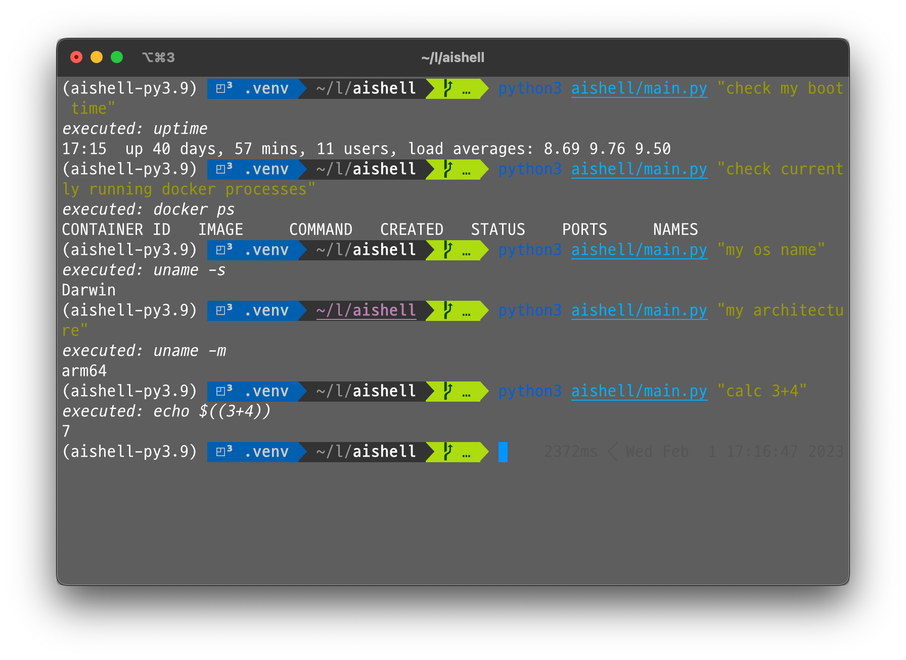
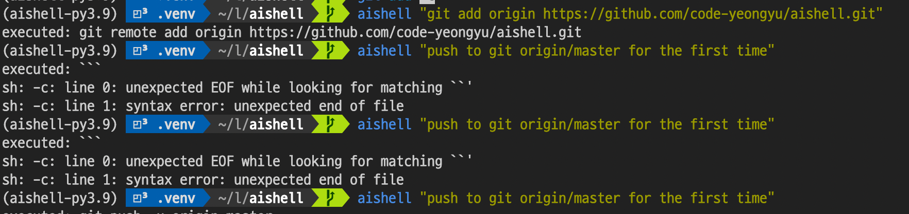
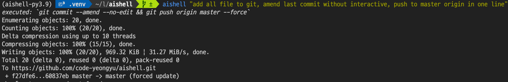

# AiShell 🤖

A simple Python code that connects to OpenAI's ChatGPT and executes the returned results.

## Examples 💡

### Simple Utility commands 🛠



### A git helper 💻



### A powerful git assistant 💪🏻👨‍💻💻: "add all files & amend last commit & push"



## Installation

```sh
curl -sL https://raw.githubusercontent.com/code-yeongyu/AiShell/master/install.sh | sh
```

## Prerequisites 📚

- Python 3.9.5
- Poetry
- OpenAI API Key

## Getting Started 🚀

1. Create account on OpenAI
1. Go to <https://platform.openai.com/account/api-keys>, Copy API key
1. Set the API key as an environment variable `OPENAI_API_KEY` or inject it directly into the code by editing it.
1. [Install](#installation)

## Contributions 💬

Feel free to contribute to AiShell by adding more functionality or fixing bugs. Some suggestions for contributions include:

- Publishing AiShell to PyPI so that others can easily download and use it
